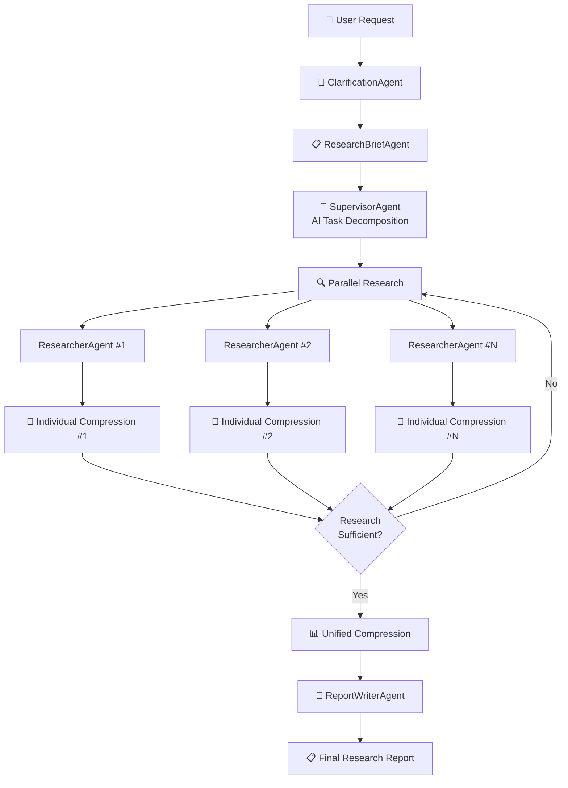

# AutoGen Research Team

An enhanced deep research system built on [Microsoft AutoGen](https://github.com/microsoft/autogen) framework, converting LangGraph's [Open-deep-Research](https://github.com/langchain-ai/open_deep_research) pattern into AutoGen's **Teams** and **Agent** patterns for comprehensive multi-agent collaborative research.

> **✅ v2.1 Complete**: Individual compression system implemented for major memory efficiency improvements! Each researcher compresses results immediately upon completion to prevent token limits and optimize performance.

## ✨ Key Features

- 🧠 **AI-based Intelligent Task Decomposition** - Integrated open_deep_research approach
- 🔄 **Individual Compression System** - Memory efficiency maximized through immediate compression upon each researcher completion
- ⚡ **Automatic Error Handling** - Azure content filters, token limits, etc.
- 🎯 **Custom Research Planning** - Dynamic task generation per research topic
- 💾 **Memory Optimization** - Token limit prevention through raw_notes removal and progressive compression
- 🚀 **Optimized Performance** - Comprehensive research reports completed within 90 seconds

## 🏗️ AutoGen Framework Architecture

Built using Microsoft AutoGen's core components:

### AutoGen Components Used
- **`AssistantAgent`**: Base class for all research agents
- **`FunctionTool`**: Implementation of web search, MCP integration tools
- **Model Clients**: `AzureOpenAIChatCompletionClient`, `OpenAIChatCompletionClient`
- **Messages**: Structured message system with `TextMessage`, `HandoffMessage`
- **Teams**: `SelectorGroupChat` pattern (future `GraphFlow` expansion planned)
- **Tool Integration**: `parallel_tool_calls` support for parallel tool execution

### System Architecture



### Agent Details

| Agent | AutoGen Base | Role | Tools |
|-------|--------------|------|-------|
| **ClarificationAgent** | `AssistantAgent` | Clarifies ambiguous user requests | - |
| **ResearchBriefAgent** | `AssistantAgent` | Converts requests to detailed research plans | - |
| **SupervisorAgent** | `AssistantAgent` + `FunctionTool` | Orchestrates research process with AI-based completion judgment | `conduct_research`, `research_complete` |
| **ResearcherAgent** | `AssistantAgent` + `FunctionTool` | Performs actual research on assigned topics | `web_search`, `research_complete`, MCP tools |
| **CompressionAgent** | `AssistantAgent` | Individual & unified compression of research results | - |
| **ReportWriterAgent** | `AssistantAgent` | Generates final markdown reports | - |

## 🚀 Quick Start

### Installation

```bash
pip install -r requirements.txt
cp env.example .env
```

### Environment Setup

Choose one of the following model providers:

#### Azure OpenAI (Recommended)
```bash
MODEL_PROVIDER=azure_openai
AZURE_OPENAI_API_KEY=your-azure-openai-api-key
AZURE_OPENAI_ENDPOINT=https://your-resource.openai.azure.com/
AZURE_OPENAI_DEPLOYMENT_NAME=your-deployment-name
```

#### OpenAI
```bash
MODEL_PROVIDER=openai
OPENAI_API_KEY=your-openai-api-key
```

#### Local Models (Ollama)
```bash
MODEL_PROVIDER=local
LOCAL_BASE_URL=http://localhost:11434/v1
LOCAL_MODEL_NAME=llama2
```

### Search API Setup

```bash
# Tavily (Recommended)
TAVILY_API_KEY=your-tavily-api-key
SEARCH_APIS=tavily,duckduckgo

# Or DuckDuckGo only (Free)
SEARCH_APIS=duckduckgo
```

## 📖 Usage

### Basic Usage

```python
import asyncio
from autogen_open_deep_research import run_deep_research

async def main():
    # Research request
    request = "What are the latest developments in quantum computing and its potential applications in cryptography?"
    
    # Execute research
    report = await run_deep_research(request)
    
    # Print results
    print(f"Title: {report.title}")
    print(f"Summary: {report.executive_summary}")
    print(f"Sources: {len(report.sources)}")

asyncio.run(main())
```

### Advanced Usage

```python
from autogen_open_deep_research import (
    DeepResearchTeam, 
    Configuration, 
    load_configuration
)

async def advanced_research():
    # Load custom configuration
    config = load_configuration()
    
    # Modify settings
    config.max_concurrent_research_units = 3
    config.allow_clarification = False
    
    # Create research team
    team = DeepResearchTeam(config)
    
    # Execute research
    report = await team.process_research_request(
        "Research the latest trends in artificial intelligence"
    )
    
    return report
```

## ⚙️ Configuration

### Model Settings

Different models for different agents:

```python
AZURE_OPENAI_RESEARCH_DEPLOYMENT=gpt-4o          # Main research
AZURE_OPENAI_SUMMARIZATION_DEPLOYMENT=gpt-4o-mini # Summarization
AZURE_OPENAI_COMPRESSION_DEPLOYMENT=gpt-4o-mini   # Compression
AZURE_OPENAI_FINAL_REPORT_DEPLOYMENT=gpt-4o       # Final report
```

### Research Parameters

```python
config = Configuration()
config.max_concurrent_research_units = 5    # Concurrent research units
config.max_researcher_iterations = 3        # Max research iterations
config.max_react_tool_calls = 5            # Max tool calls per researcher
config.allow_clarification = True          # Enable clarification step
```

## 🔄 Key Differences from open_deep_research

| Feature | open_deep_research (LangGraph) | autogen-research-team (AutoGen) |
|---------|-------------------------------|--------------------------------|
| **Framework** | LangGraph state machines | AutoGen multi-agent system |
| **Agent Pattern** | State-based workflows | `AssistantAgent` with `FunctionTool` |
| **Tool Integration** | LangGraph tools | AutoGen `FunctionTool` with `parallel_tool_calls` |
| **Message Passing** | State updates | `TextMessage`, `HandoffMessage` |
| **Research Completion** | Hard-coded thresholds | AI-based intelligent judgment |
| **Memory Management** | Standard state persistence | Individual compression system (v2.1) |
| **Error Handling** | Basic retry logic | Advanced AutoGen error recovery |

## 🛠️ AutoGen Integration Details

### Model Client Management
```python
# Dedicated model clients per agent type
model_clients = {
    "research": AzureOpenAIChatCompletionClient(model="gpt-4o"),
    "summarization": AzureOpenAIChatCompletionClient(model="gpt-4o-mini"),
    "compression": AzureOpenAIChatCompletionClient(model="gpt-4o-mini"),
    "final_report": AzureOpenAIChatCompletionClient(model="gpt-4o")
}

# Enable parallel_tool_calls for tool-using agents
tool_enabled_client = model_client.model_copy()
tool_enabled_client.parallel_tool_calls = True
```

### Tool Integration
```python
# Web search tool implementation using FunctionTool
search_tool = FunctionTool(
    func=web_search_tavily,
    description="Search the web for information",
    name="web_search"
)

# Register tools with agent
researcher = ResearcherAgent(
    name="Researcher_0",
    model_client=tool_enabled_client,
    tools=[search_tool, research_complete_tool]
)
```

## 🔮 Future Plans

### AutoGen Advanced Features
- **`GraphFlow` Integration**: Complex multi-step workflow routing
- **`SelectorGroupChat` Full Implementation**: Intelligent agent selection system
- **`UserProxyAgent` Integration**: User approval steps
- **Enhanced Termination Conditions**: More sophisticated completion criteria

### Additional Integrations
- **MCP (Model Context Protocol)**: External database and file system integration
- **Result Caching**: AutoGen message-level deduplication
- **Multi-language Support**: Research in various languages
- **Custom Agent Types**: Domain-specific specialized agents

## 🤝 Contributing

1. Fork the repository
2. Create a feature branch (`git checkout -b feature/AmazingFeature`)
3. Commit your changes (`git commit -m 'Add some AmazingFeature'`)
4. Push to the branch (`git push origin feature/AmazingFeature`)
5. Open a Pull Request

## 📄 License

This project is licensed under the MIT License - see the `LICENSE` file for details.

## 👨‍💻 Author

**Kim Jaehyun**
- 📧 Email: hyun030508@gmail.com
- 🏢 AutoGen Deep Research System Developer

## 🙏 Acknowledgments

- **[Microsoft AutoGen](https://github.com/microsoft/autogen)** - Core multi-agent framework
- **[LangGraph Open-deep-Research](https://github.com/langchain-ai/open_deep_research)** - Original research pattern inspiration
- **[Tavily Search API](https://tavily.com/)** - High-quality web search service
- **[OpenAI](https://openai.com/)** & **[Azure OpenAI Service](https://azure.microsoft.com/products/ai-services/openai-service)** - AI model services

---

**Happy Researching! 🔬✨**
